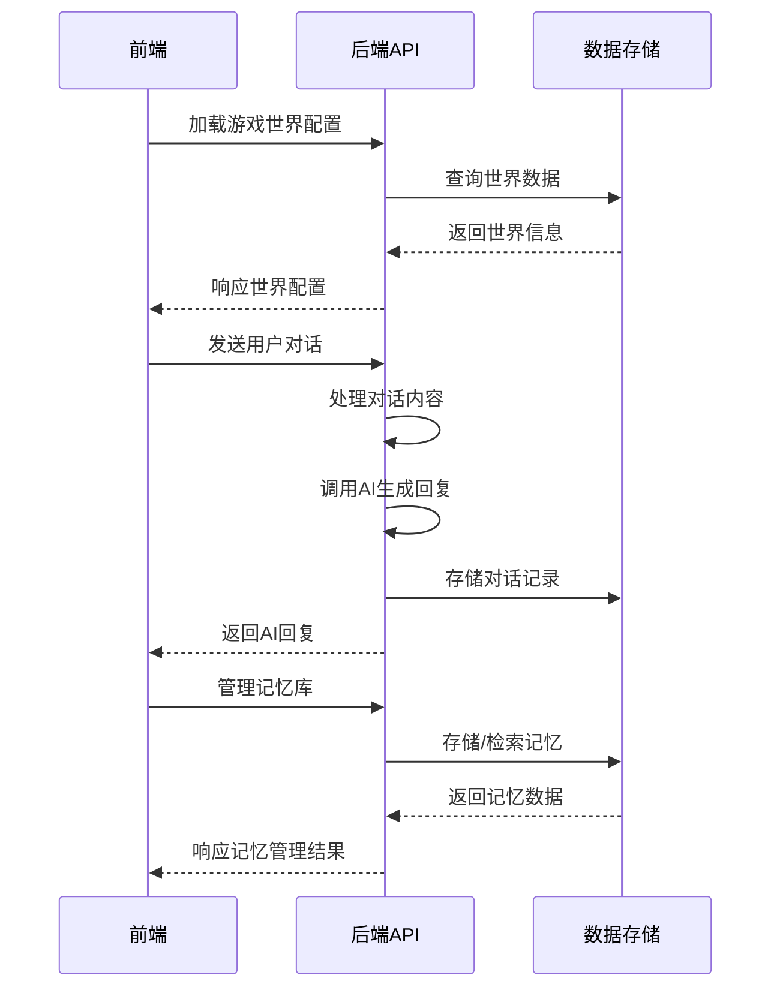

# GalGame 工程架构分析

## 1. 仓库概览

GalGame 是一个基于 AI 的互动式文字游戏平台，融合了角色扮演、对话系统和记忆管理功能，为用户提供沉浸式的游戏体验。

### 主要功能与亮点
- **AI 驱动的对话系统**：支持与游戏角色进行自然语言交互
- **记忆库系统**：实现短期、长期和核心记忆的管理与融合
- **多世界支持**：用户可以在不同的游戏世界中切换
- **个性化设置**：支持用户自定义世界书、提示词和AI配置
- **图库系统**：根据场景自动匹配背景图片
- **响应式界面**：现代化的游戏界面设计

### 典型应用场景
- 玩家与AI角色进行互动对话，推进游戏剧情
- 作者创建和管理游戏世界，配置角色和场景
- 玩家通过记忆库系统回顾和管理游戏中的重要事件

## 2. 目录结构

GalGame 采用前后端分离的架构设计，前端负责界面交互，后端提供API支持。整体结构清晰，职责明确，便于维护和扩展。

```text
├── backend/            # 后端服务
│   ├── config/         # 配置文件
│   ├── data/           # 数据存储（内存模式）
│   ├── middleware/     # 中间件
│   ├── models/         # 数据模型
│   ├── routes/         # API路由
│   ├── services/       # 业务服务
│   ├── utils/          # 工具函数
│   ├── validators/     # 数据验证
│   └── server.js       # 服务器入口
├── public/             # 前端静态资源
│   ├── css/            # 样式文件
│   └── js/             # JavaScript文件
│       ├── components/  # 组件
│       ├── core/        # 核心功能
│       ├── game/        # 游戏逻辑
│       ├── services/    # 前端服务
│       └── settings/    # 设置功能
├── test/               # 测试文件
├── galgame_framework_backup.html  # 主游戏界面
└── index.html          # 主入口
```

### 核心文件说明

| 文件/目录 | 职责 | 位置 | 说明 |
|----------|------|------|------|
| galgame_framework_backup.html | 主游戏界面 | 根目录 | 包含游戏的主要UI结构 |
| public/js/game/game-main.js | 游戏核心逻辑 | public/js/game/ | 处理游戏状态、对话和AI交互 |
| backend/server.js | 后端服务器 | backend/ | 服务器配置和路由注册 |
| backend/routes/ | API路由 | backend/routes/ | 各种API接口的实现 |
| backend/models/ | 数据模型 | backend/models/ | 数据结构和存储逻辑 |

## 3. 系统架构与主流程

GalGame 采用典型的三层架构，包括前端界面层、后端服务层和数据存储层。系统通过RESTful API进行前后端通信，实现了游戏逻辑的分离和模块化。

### 架构分层

1. **前端界面层**：负责用户交互和界面渲染
   - 游戏主界面（galgame_framework_backup.html）
   - 角色层、对话层、背景层等UI组件
   - 前端逻辑（game-main.js）

2. **后端服务层**：处理业务逻辑和API请求
   - 路由处理（routes/）
   - 业务服务（services/）
   - 中间件（middleware/）

3. **数据存储层**：管理数据持久化
   - MongoDB（首选）
   - 内存存储（fallback）
   - 文件持久化（memoryStore）

### 主要数据流



### 游戏主流程

1. **初始化阶段**：
   - 检查用户认证状态
   - 加载游戏世界配置
   - 初始化UI组件
   - 加载记忆库数据

2. **对话阶段**：
   - 用户输入对话内容
   - 前端处理输入并发送到后端
   - 后端调用AI生成回复
   - 前端展示AI回复
   - 更新记忆库

3. **管理阶段**：
   - 记忆库管理（合并、导入）
   - 个人设置调整
   - 游戏世界切换

## 4. 核心功能模块

### 4.1 AI对话系统

AI对话系统是GalGame的核心功能，允许用户与游戏角色进行自然语言交互。

**功能特点**：
- 支持多角色对话
- 基于场景的背景图匹配
- 角色性格和对话风格定制
- 流式输出（实时显示AI回复）

**实现方式**：
- 前端：`game-main.js` 中的 `handleChatMessage` 函数处理用户输入
- 后端：`routes/dialogue.js` 处理对话请求并调用AI服务
- AI配置：支持多种AI提供商（SiliconFlow、OpenAI等）

### 4.2 记忆库系统

记忆库系统用于存储和管理游戏中的重要事件，分为短期、长期和核心记忆三个层次。

**功能特点**：
- 自动生成短期记忆
- 定期合并为长期记忆
- 手动整理核心记忆
- 支持导入到世界书

**实现方式**：
- 前端：记忆库面板和相关管理功能
- 后端：`routes/memories.js` 处理记忆的存储和检索
- 数据结构：短期记忆（对话摘要）、长期记忆（事件总结）、核心记忆（关键信息）

### 4.3 多世界支持

系统支持多个游戏世界，用户可以在不同世界间切换，每个世界有独立的配置和数据。

**功能特点**：
- 世界列表管理
- 世界配置加载
- 自定义聊天界面
- 世界特定的图库和角色

**实现方式**：
- 前端：游戏列表弹窗和世界切换功能
- 后端：`routes/games.js` 处理世界的创建和管理
- 存储：每个世界有独立的配置和数据

### 4.4 图库系统

图库系统管理游戏中的图片资源，并根据场景自动匹配背景图片。

**功能特点**：
- 场景匹配背景图
- 支持多种图片类型（背景、角色、CG等）
- 基于关键词的匹配算法
- 可自定义图片库

**实现方式**：
- 前端：`matchBackgroundForScene` 函数处理背景匹配
- 后端：`routes/gallery-v2.js` 提供图片管理和匹配API
- 算法：结合后端AI匹配和本地简单匹配

### 4.5 用户认证与个人设置

系统实现了用户认证和个性化设置功能，确保用户数据的安全和个性化体验。

**功能特点**：
- JWT认证
- 个人世界书管理
- AI配置预设
- 提示词定制

**实现方式**：
- 前端：登录页面和个人设置面板
- 后端：`routes/auth.js` 处理认证请求
- 存储：用户设置保存在localStorage中

## 5. 核心 API/类/函数

### 前端核心函数

| 函数名 | 功能 | 参数 | 返回值 | 位置 |
|-------|------|------|-------|------|
| `loadWorldConfig()` | 加载游戏世界配置 | 无 | Promise<WorldConfig> | game-main.js:19 |
| `handleChatMessage(text)` | 处理用户对话输入 | text: string | void | game-main.js |
| `matchBackgroundForScene(sceneText)` | 匹配场景背景图 | sceneText: string | Promise<Image> | game-main.js:126 |
| `applyWorldConfig(world)` | 应用世界配置 | world: WorldConfig | void | game-main.js:228 |
| `saveUserSettings()` | 保存用户设置 | 无 | void | game-main.js:984 |

### 后端核心API

| API路径 | 方法 | 功能 | 认证 | 位置 |
|--------|------|------|------|------|
| `/api/auth/register` | POST | 用户注册 | 否 | routes/auth.js:21 |
| `/api/auth/login` | POST | 用户登录 | 否 | routes/auth.js:79 |
| `/api/games` | GET | 获取游戏列表 | 可选 | routes/games.js |
| `/api/games/:slug` | GET | 获取游戏详情 | 可选 | routes/games.js |
| `/api/dialogue` | POST | 处理对话 | 是 | routes/dialogue.js |
| `/api/memories` | GET | 获取记忆列表 | 是 | routes/memories.js |
| `/api/gallery/:gameId/match` | POST | 匹配场景图片 | 可选 | routes/gallery-v2.js |

### 核心类

| 类名 | 功能 | 主要方法 | 位置 |
|------|------|----------|------|
| `MemoryStore` | 内存存储管理 | create, find, update, delete | utils/memoryStore.js:9 |
| `FilePersistence` | 文件持久化 | save, load, startAutoSave | utils/filePersistence.js:13 |
| `DialogueService` | 对话服务 | generateResponse, processMessage | services/dialogueService.js |
| `ExperienceMemoryBridge` | 经验记忆桥接 | createMemoryFromExperience | services/experienceMemoryBridge.js |

## 6. 技术栈与依赖

| 类别 | 技术/依赖 | 用途 | 位置 |
|------|-----------|------|------|
| 前端 | HTML5/CSS3/JavaScript | 界面构建 | galgame_framework_backup.html |
| 前端 | localStorage | 本地数据存储 | game-main.js |
| 后端 | Node.js/Express | 服务器框架 | server.js |
| 后端 | MongoDB | 数据存储 | server.js:29 |
| 后端 | JWT | 认证 | middleware/auth.js |
| 后端 | bcryptjs | 密码加密 | models/user.js |
| AI | SiliconFlow/OpenAI | AI对话生成 | game-main.js:613 |
| 工具 | faker-js/faker | 测试数据生成 | test/setup.js |
| 测试 | Jest/Supertest | 测试框架 | test/ |

## 7. 关键模块与典型用例

### 7.1 AI对话模块

**功能说明**：处理用户与AI角色的对话，生成符合角色性格的回复。

**配置与依赖**：
- AI API密钥（需在设置中配置）
- 角色提示词设置
- AI模型选择（默认：DeepSeek-V3.2）

**使用示例**：

```javascript
// 前端发送对话
function handleChatMessage(text) {
  // 显示用户输入
  addMessage('You', text);
  
  // 发送到后端
  fetch(`${API_BASE}/dialogue`, {
    method: 'POST',
    headers: getAuthHeaders(),
    body: JSON.stringify({
      message: text,
      characterId: currentCharacterId,
      gameId: currentWorld._id
    })
  })
  .then(response => response.json())
  .then(data => {
    if (data.success) {
      // 显示AI回复
      addMessage(data.data.character, data.data.response);
      // 更新记忆
      updateMemory(text, data.data.response);
    }
  });
}
```

### 7.2 记忆库管理模块

**功能说明**：管理游戏中的记忆，包括自动生成和手动整理。

**配置与依赖**：
- 记忆存储（localStorage或后端数据库）
- 记忆合并规则

**使用示例**：

```javascript
// 合并短期记忆为长期记忆
function mergeShortTermMemories() {
  const shortMemories = getShortTermMemories();
  if (shortMemories.length >= 6) {
    const mergedContent = shortMemories.map(m => m.content).join(' ');
    const longMemory = {
      id: generateId(),
      content: summarizeContent(mergedContent),
      type: 'long',
      timestamp: new Date().toISOString()
    };
    saveLongTermMemory(longMemory);
    clearShortTermMemories();
  }
}
```

## 8. 配置、部署与开发

### 8.1 配置管理

**前端配置**：
- API基础URL：`API_BASE`（默认：http://localhost:3000/api）
- 用户设置：保存在localStorage中
- AI配置：支持多个预设模板

**后端配置**：
- 服务器端口：`config.server.port`（默认：3000）
- 数据库连接：`config.database.uri`
- JWT密钥：`config.jwt.secret`

### 8.2 部署流程

1. **后端部署**：
   - 安装依赖：`npm install`
   - 启动服务器：`node server.js`
   - 可选：配置环境变量

2. **前端部署**：
   - 静态文件部署到Web服务器
   - 确保API地址正确配置

### 8.3 开发流程

1. **后端开发**：
   - 运行测试：`node test/run-tests.js`
   - 代码检查：`npm run lint`

2. **前端开发**：
   - 直接修改HTML和JS文件
   - 浏览器刷新查看效果

## 9. 监控与维护

### 9.1 日志系统

- **后端日志**：使用 `Logger` 工具记录系统事件和错误
- **错误处理**：全局错误处理中间件捕获异常
- **健康检查**：`/health` 接口监控系统状态

### 9.2 常见问题与解决方案

| 问题 | 原因 | 解决方案 |
|------|------|----------|
| 认证失败 | JWT令牌过期或无效 | 重新登录获取新令牌 |
| AI回复缓慢 | API响应延迟 | 检查网络连接，调整AI配置 |
| 内存占用过高 | 记忆库过大 | 定期清理不需要的记忆 |
| 背景图匹配失败 | 图库数据不足 | 添加更多背景图片到图库 |

## 10. 总结与亮点回顾

GalGame 是一个功能完整、架构清晰的AI驱动游戏平台，具有以下核心优势：

### 技术亮点

1. **模块化架构**：前后端分离，职责明确，便于维护和扩展
2. **多存储支持**：同时支持MongoDB和内存存储，提高系统可靠性
3. **智能记忆系统**：自动管理不同层次的记忆，增强游戏体验的连续性
4. **场景感知**：根据对话内容自动匹配背景图片，提升沉浸感
5. **高度可定制**：支持用户自定义世界书、提示词和AI配置

### 应用价值

GalGame 不仅是一个游戏平台，更是一个AI交互的实验场，展示了如何将大型语言模型应用于交互式娱乐场景。通过记忆库系统和场景感知能力，它为AI游戏的发展提供了新的思路。

### 未来展望

1. **增强AI能力**：集成更多AI模型，提供更丰富的角色交互体验
2. **多模态支持**：添加语音和图像生成功能
3. **社区功能**：支持用户创建和分享游戏世界
4. **跨平台支持**：开发移动应用版本

GalGame 代表了AI与游戏结合的前沿尝试，通过不断优化和扩展，有望成为AI交互娱乐的重要平台。